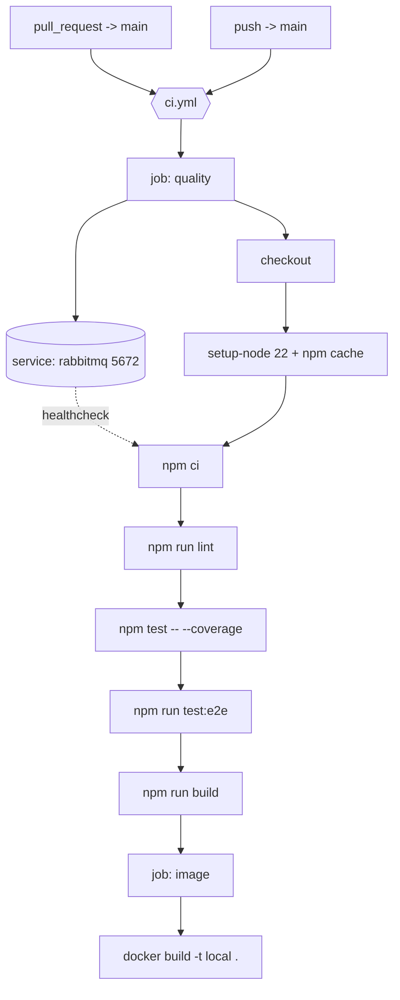

# CI Pipeline Design

**Spec**: `.specs/features/ci-pipeline/spec.md`
**Status**: Draft

---

## Architecture Overview

One workflow file, two jobs. The `quality` job differs from the other three services in one decisive way: this repository's end-to-end suite opens a real AMQP connection, so the job runs a RabbitMQ service container alongside it. Everything else is a remote executor for gates that already exist.

---

## Observed check name (recorded by T6)

The required status check is named **`quality`**, verified against a real pull request on
2026-09-20 and now enforced by the `protect main` ruleset. Renaming the job silently
detaches that rule, so the name is a published contract.

Jobs deliberately left out of the required set: they either depend on the gate or can
legitimately not run, so requiring them would let an unrelated condition block merges.

---

## Code Reuse Analysis

### Existing Components to Leverage

| Component | Location | How to Use |
| --- | --- | --- |
| Quality scripts | `package.json` | Invoke `lint`, `test`, `test:e2e`, `build` unchanged |
| Lockfile | `package-lock.json` | `npm ci` installs from it and fails on drift |
| Broker image | `compose.yaml` in `fiap-x-platform` | Reuse `rabbitmq:4-management-alpine` so CI and the local loop exercise the same broker |
| Container build | `Dockerfile` | Built as-is |
| E2E runner config | `test/jest-e2e.json` | Invoked through `npm run test:e2e` |

### Integration Points

| System | Integration Method |
| --- | --- |
| Branch protection on `main` | The `quality` job name is the required status check; renaming it silently detaches the rule |
| RabbitMQ | A service container published on 5672, reached at the address the suite already hardcodes |
| GitHub Actions cache | `actions/setup-node` with `cache: npm` |

---

## Components

### Workflow: `ci`

- **Purpose**: Run every existing quality gate, with a broker available, on pull requests and on `main`.
- **Location**: `.github/workflows/ci.yml`
- **Interfaces**: triggers `pull_request` to `main` and `push` to `main`; published job names `quality` and `image`
- **Dependencies**: `actions/checkout`, `actions/setup-node`, `actions/upload-artifact`
- **Reuses**: the `package.json` scripts and the `Dockerfile` verbatim

### Service container: `rabbitmq`

- **Purpose**: Satisfy the end-to-end suite's real AMQP connection.
- **Location**: `.github/workflows/ci.yml`, `services:` block of the `quality` job
- **Interfaces**: image `rabbitmq:4-management-alpine`, port 5672 mapped to the runner's localhost, health check `rabbitmq-diagnostics -q ping`
- **Dependencies**: none beyond the runner's Docker daemon
- **Reuses**: the same image and health command already proven in `compose.yaml`

### Job: `image`

- **Purpose**: Prove the Dockerfile still builds before the change reaches `main`.
- **Location**: `.github/workflows/ci.yml`
- **Interfaces**: `needs: quality`, local tag, no push
- **Dependencies**: the repository `Dockerfile`
- **Reuses**: `Dockerfile`, `.dockerignore`

---

## Data Models (if applicable)

Not applicable - this feature adds no runtime data.

---

## Error Handling Strategy

| Error Scenario | Handling | User Impact |
| --- | --- | --- |
| Lint reports an error or a warning | `npm run lint` exits non-zero | The check turns red at the lint step |
| A unit or e2e test fails | The step exits non-zero; later steps do not run | The failing test name is visible in the log |
| The broker never becomes healthy | The service health check fails before the suite starts | The failure is attributed to broker startup, not to an opaque connection error inside a test |
| Lockfile drifted from `package.json` | `npm ci` exits non-zero | The check fails at install with the drift named |
| Dockerfile regression | The `image` job fails after `quality` passed | The failure is isolated to the image job |
| A newer commit supersedes the run | The concurrency group cancels the in-flight run | The reported status reflects the current head |
| A job hangs | `timeout-minutes: 15` fails it | The runner is released |

---

## Risks & Concerns

| Concern | Location (file:line) | Impact | Mitigation |
| --- | --- | --- | --- |
| The e2e suite hardcodes `amqp://localhost:5672` with no environment override and no skip guard | `test/local-integration.e2e-spec.ts:14` | CI cannot point the suite at a broker on any other address, and the suite fails rather than skips wherever a broker is absent | The service container is published on exactly that address, which makes the hardcoded value correct rather than merely tolerated. Introducing a `RABBITMQ_URL` override would change test behaviour and is outside this slice; raised as a follow-up. |
| No `engines` field pins the Node version | `package.json` | CI and the Dockerfile can drift apart silently | The workflow pins Node 22 and the design records the Dockerfile as the single source; adding `engines` is proposed as a follow-up |
| The real verification of a workflow cannot happen before it runs on the platform | `.github/workflows/ci.yml` | A syntactically valid workflow can still be semantically wrong | T7 verifies the workflow on a real pull request by injecting a failure, observing the check go red, and reverting |

> Lessons note: `.specs/` holds no `LESSONS.md` for this repository, so no lessons were available to load.

---

## Tech Decisions (only non-obvious ones)

| Decision | Choice | Rationale |
| --- | --- | --- |
| How the e2e suite reaches a broker | A service container, not a Compose stack | The suite needs one broker at one address; starting the whole topology would couple this repository's gate to the other four |
| Broker image | `rabbitmq:4-management-alpine` | Identical to `compose.yaml`, so a broker-version problem surfaces the same way locally and in CI |
| Readiness strategy | The service's own health check, not a sleep | A fixed sleep is either flaky or wasteful; the health check is the only correct signal |
| One workflow file or several | One `ci.yml` with two jobs | Keeps the number of status-check names branch protection tracks to a minimum |
| Whether coverage can fail the build | It cannot | No baseline exists; a threshold without one blocks work arbitrarily |

> **Project-level decisions:** none here set a new convention beyond the job-name contract, recorded above as an integration point.
