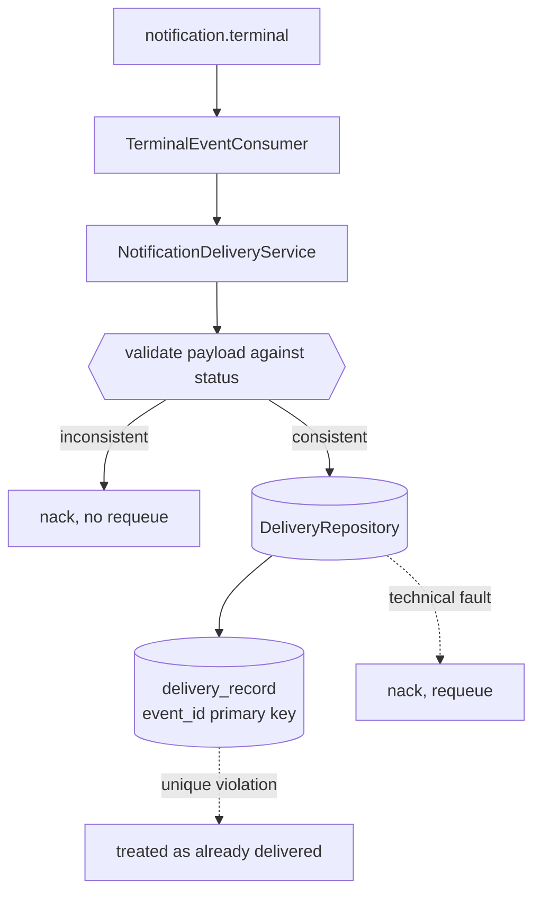

# Durable Persistence Design

**Spec**: `.specs/features/durable-persistence/spec.md`
**Status**: Draft

---

## Architecture Overview

The smallest of the three, for one reason worth stating: this service's repository port is **already asynchronous**. Swapping the in-memory adapter for PostgreSQL is an adapter change with no ripple through the service, the consumer or their tests — unlike the Catalog, where the same move rewrites nine files.



The deduplication guarantee moves from application code into the schema. `findByEventId` returning nothing followed by `save` is a check-then-act that two replicas can both win; `event_id` as the primary key makes the database the arbiter.

---

## Code Reuse Analysis

### Existing Components to Leverage

| Component | Location | How to Use |
| --- | --- | --- |
| Repository port | `src/notifications/domain/delivery.repository.ts` | Unchanged - already three promise-returning methods |
| Delivery service | `src/notifications/application/notification-delivery.service.ts` | Unchanged except for treating a unique violation as an already-recorded delivery |
| In-memory adapter | `src/notifications/infrastructure/persistence/in-memory-delivery.repository.ts` | Kept as the unit-test adapter |
| Typed errors | `src/notifications/domain/errors/` | `DeliveryPersistenceError` already carries the requeue meaning the consumer acts on |
| Health module | `src/health/` | Gains a database indicator beside the broker one, same shape |

### Integration Points

| System | Integration Method |
| --- | --- |
| PostgreSQL | TypeORM data source, its own schema - the foundation forbids sharing tables with the Catalog |
| RabbitMQ | Unchanged |
| `fiap-x-platform` | Provides the database service and generates the creation deliverable from this migration |

---

## Components

### `DeliveryRecord` entity

- **Purpose**: Map the existing record onto a table.
- **Location**: `src/notifications/infrastructure/persistence/delivery-record.entity.ts`
- **Interfaces**: `event_id` primary key; `zip_storage_key` and `failure_reason` nullable
- **Dependencies**: TypeORM
- **Reuses**: the `DeliveryRecord` shape settled in S2

The entity is kept separate from the domain class so persistence annotations do not leak into the domain, matching how the Catalog separates its aggregate from storage.

### `TypeOrmDeliveryRepository`

- **Purpose**: The port, against PostgreSQL.
- **Location**: `src/notifications/infrastructure/persistence/typeorm-delivery.repository.ts`
- **Interfaces**: implements `DeliveryRepository` unchanged
- **Dependencies**: `DataSource`
- **Reuses**: the in-memory adapter's behaviour as the specification of what it must do

`save` translates a unique-key violation into the existing record rather than letting it escape as a persistence error — otherwise a concurrent redelivery would requeue forever against a row that is already correct.

### Database health indicator

- **Purpose**: Make readiness reflect the database.
- **Location**: `src/health/database.health-indicator.ts`
- **Interfaces**: same shape as `rabbitmq-health.indicator.ts`
- **Dependencies**: `DataSource`
- **Reuses**: the existing indicator as the template

---

## Data Models

```sql
delivery_record (
  event_id              uuid primary key,
  processing_request_id uuid        not null,
  owner_user_id         text        not null,
  status                text        not null,
  zip_storage_key       text        null,
  failure_reason        text        null,
  recorded_at           timestamptz not null
)
```

**Relationships**: none. This table is this service's own fact and references nothing the Catalog owns, which is what keeps the boundary the foundation requires. An index on `processing_request_id` serves the local observation route.

---

## Error Handling Strategy

| Error Scenario | Handling | User Impact |
| --- | --- | --- |
| Contract violation | Refused before any write, as in S2 | Nothing recorded; nacked without requeue |
| Concurrent duplicate `eventId` | The unique violation is caught and the existing record returned | One row, both messages acknowledged |
| Database unreachable | `DeliveryPersistenceError`; readiness reports not-ready | The message requeues and is retried |
| Any other persistence fault | Same, since a retry can succeed where a contract violation cannot | Unchanged from today |

---

## Risks & Concerns

| Concern | Location (file:line) | Impact | Mitigation |
| --- | --- | --- | --- |
| A unique violation surfacing as a generic persistence error would requeue forever | `typeorm-delivery.repository.ts` | A redelivered event would loop against a row that is already correct, and the queue would never drain | `save` distinguishes the unique violation explicitly and returns the existing record. A test drives two concurrent saves of the same `eventId` and asserts one row and no error |
| The service's readiness currently reflects only the broker | `src/health/health.controller.ts` | Traffic would be accepted while the database is down, turning every message into a requeue | A database indicator is added in the same slice |
| `findByEventId` then `save` is a check-then-act | `notification-delivery.service.ts` | Two replicas can both pass the check | The primary key makes the database the arbiter; the service keeps the read as a fast path, not as the guarantee |

> Lessons note: this repository has no `.specs/LESSONS.md`, so no lessons were available to load.

---

## Tech Decisions (only non-obvious ones)

| Decision | Choice | Rationale |
| --- | --- | --- |
| ORM | TypeORM | Matches the Catalog and the C4 code diagram; two ORMs in one system would be a gratuitous difference |
| Entity separate from the domain class | Separate | Keeps persistence annotations out of the domain, as the Catalog does |
| Deduplication guarantee | The primary key, not the application read | A read-then-write cannot be made safe across replicas without the constraint |
| Schema, not a separate database | Its own schema in the shared server | The foundation forbids shared tables, which a schema enforces; a second container would double the footprint for the same boundary |
| Keeping the in-memory adapter | Kept | Unit tests stay fast; the PostgreSQL adapter is proven against PostgreSQL |

> **Project-level decisions:** none beyond the ORM choice, which the Catalog's design records for the project.
