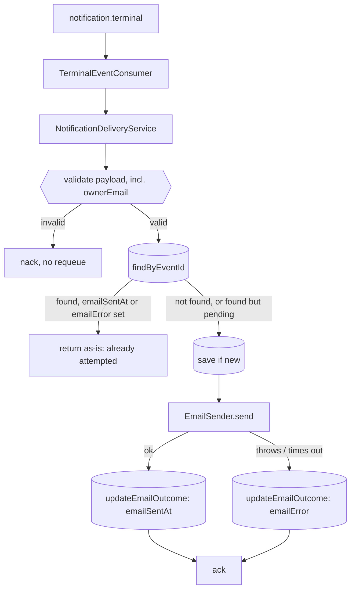

# Email Notification — Notification Service Design

**Spec**: `.specs/features/email-notification/spec.md`
**Status**: Draft

---

## Architecture Overview

The delivery record already carries the dedup guarantee (`event_id` as primary key, from the durable-persistence slice). This slice adds a second guarantee on the same row — "has an email attempt already completed for this row" — and one new outbound port.



The "found but pending" branch is what makes this safe across a crash: the consumer only acks after `recordDelivery` returns, so a process death between `save` and `send` leaves an unacked message. Its redelivery finds the row already there but with no outcome recorded yet, and still gets exactly one send attempt — never two, never zero.

---

## Code Reuse Analysis

### Existing Components to Leverage

| Component | Location | How to Use |
| --- | --- | --- |
| `NotificationDeliveryService` | `src/notifications/application/notification-delivery.service.ts` | Extended, not replaced: the existing validation and dedup-by-`eventId` logic stays; the send/outcome step is added after it |
| `DeliveryRecord` | `src/notifications/domain/delivery-record.ts` | Gains two nullable-in-practice fields |
| `DeliveryRepository` port | `src/notifications/domain/delivery.repository.ts` | Gains one method, `updateEmailOutcome` |
| `TypeOrmDeliveryRepository` / `InMemoryDeliveryRepository` | `src/notifications/infrastructure/persistence/` | Both implement the new method; the unique-violation-as-existing-record handling in the TypeORM adapter is unchanged |
| `NotificationsModule`'s `isDatabaseConfigured()` pattern | `src/notifications/notifications.module.ts` | Copied for `isSmtpConfigured()`: no SMTP configured → an in-memory fake sender, so unit tests and a bare `npm start` need no mailbox, exactly as they need no database today |
| `settle-failed-message.ts` | `src/notifications/infrastructure/messaging/` | Unchanged. A failed *send* never throws out of `recordDelivery`, so it never reaches this path; only a genuine contract violation or persistence fault does, same as today |

### Integration Points

| System | Integration Method |
| --- | --- |
| Mailpit (SMTP) | `nodemailer`, plain SMTP, no auth, host/port from env |
| `processing-catalog` | Same `terminal.event` consumption, one new required field on the DTO |

---

## Components

### `EmailSender` port (new)

- **Purpose**: The one thing this slice needs from SMTP.
- **Location**: `src/notifications/domain/email-sender.ts` (interface + `EmailMessage` type), `src/notifications/domain/email-sender.token.ts` (DI token)
- **Interfaces**: `send(message: { to: string; subject: string; text: string }): Promise<void>`
- **Dependencies**: none (pure interface)

### `SmtpEmailSender` adapter (new)

- **Purpose**: The real implementation, against Mailpit today.
- **Location**: `src/notifications/infrastructure/email/smtp-email-sender.ts`
- **Interfaces**: implements `EmailSender`
- **Dependencies**: `nodemailer`
- **Reuses**: nothing to reuse — this is the one genuinely new adapter in the whole feature. A bounded `connectionTimeout`/`greetingTimeout`/`socketTimeout` on the transport is what turns "SMTP hangs" into "send fails," satisfying the timeout requirement without any code-level timer

### `InMemoryEmailSender` fake (new)

- **Purpose**: Let the service boot and be unit-tested with no mailbox, mirroring `InMemoryDeliveryRepository`.
- **Location**: `src/notifications/infrastructure/email/in-memory-email-sender.ts`
- **Interfaces**: implements `EmailSender`; exposes `sent: EmailMessage[]` for assertions
- **Reuses**: the exact role `InMemoryDeliveryRepository` already plays for the database

### Templates (new, plain functions)

- **Purpose**: Render the two fixed templates.
- **Location**: `src/notifications/application/email-templates.ts`
- **Interfaces**: `renderCompletedEmail({ processingRequestId }): { subject, text }`; `renderFailedEmail({ processingRequestId, failureReason }): { subject, text }`
- **Dependencies**: none — string templates, no library

### `DeliveryRecord` (modified)

- **Purpose**: Carry the email outcome on the same row as the delivery outcome.
- **Location**: `src/notifications/domain/delivery-record.ts`
- **Interfaces**: adds `emailSentAt?: Date` and `emailError?: string`
- **Reuses**: the existing class, same "mutually exclusive-ish" comment style already used for `zipStorageKey`/`failureReason`

### `DeliveryRepository` port + both adapters (modified)

- **Purpose**: Persist the outcome of a send attempt against an existing row.
- **Location**: `src/notifications/domain/delivery.repository.ts`, both files under `infrastructure/persistence/`
- **Interfaces**: `updateEmailOutcome(eventId: string, outcome: { emailSentAt: Date } | { emailError: string }): Promise<void>`
- **Reuses**: `save()`'s existing `insert`-only behavior is untouched — it still only ever inserts a fresh row with both new columns `null`; this new method is the only thing that ever changes them, via TypeORM's `update()` (a plain `UPDATE ... WHERE event_id = ?`, no upsert semantics needed since the row is known to exist by this point)

### `NotificationDeliveryService` (modified)

- **Purpose**: Add the send step after the existing validate-then-dedup logic.
- **Location**: `src/notifications/application/notification-delivery.service.ts`
- **Interfaces**: constructor gains `@Inject(EMAIL_SENDER) private readonly emailSender: EmailSender`; `recordDelivery` unchanged in signature
- **Reuses**: the existing validation block (extended with an `ownerEmail` check, same style as the `zipStorageKey`/`failureReason` checks); a new private `attemptEmail(record: DeliveryRecord): Promise<void>` method keeps the try/catch/persist-outcome logic out of the main method body

Revised flow inside `recordDelivery`, after the existing validation:

```
let record = await this.deliveryRepository.findByEventId(event.eventId);
if (record && (record.emailSentAt || record.emailError)) {
  return record; // an attempt already completed — dedup
}
if (!record) {
  record = <build as today>;
  record = await this.deliveryRepository.save(record);
}
await this.attemptEmail(record); // mutates record.emailSentAt / .emailError and persists via updateEmailOutcome
return record;
```

### `NotificationsModule` (modified)

- **Purpose**: Wire the new port.
- **Location**: `src/notifications/notifications.module.ts`
- **Reuses**: the exact `dataSourceProvider`/`isDatabaseConfigured()` shape, copied for `emailSenderProvider`/`isSmtpConfigured()` (checks `process.env.SMTP_HOST`)

### `TerminalEventDto` (modified)

- **Location**: `src/notifications/dtos/terminal-event.dto.ts`
- **Interfaces**: adds `ownerEmail: string`

---

## Data Models

```sql
-- delivery_record, two new columns
email_sent_at timestamptz null,
email_error   text        null
```

**Relationships**: none new. Both columns live on the existing row, keyed by the same `event_id`. No index needed — never queried on, only read/written by `event_id`.

**Migration**: a new file following `1789954000000-CreateDeliveryRecord.ts`'s naming convention (next timestamp), adding both columns nullable — an additive, backward-compatible change, satisfying "applied to an existing table without data loss."

---

## Error Handling Strategy

| Error Scenario | Handling | User Impact |
| --- | --- | --- |
| Contract violation (missing `ownerEmail`, or the existing checks) | Refused before any write or send, as today | Nacked without requeue; no record, no send |
| SMTP send throws or times out | Caught in `attemptEmail`; `emailError` set to the error's `code` when present (else a bounded `error.message`), never the raw `Error` object or stack; logged at `warn` | One email lost, recorded and observable; message still acked |
| `updateEmailOutcome` itself fails (a database blip right after a successful or failed send) | Propagates as a technical fault; the existing `settleFailedMessage` requeues the message | A redelivery re-runs `recordDelivery`; if the send itself had actually succeeded, this is the one accepted residual risk in this design — see Risks |
| Database unreachable at the `findByEventId`/`save` step | Unchanged from the durable-persistence slice: requeued | Unchanged |

---

## Risks & Concerns

| Concern | Location (file:line) | Impact | Mitigation |
| --- | --- | --- | --- |
| A send succeeds, but the `updateEmailOutcome(emailSentAt)` write fails before it commits | `notification-delivery.service.ts` (`attemptEmail`) | The message is requeued as a technical fault, and the redelivery finds a row with no outcome recorded yet → sends a second, real email | Accepted residual risk: fixing it needs a distributed transaction across SMTP and PostgreSQL, which is out of proportion to a failure mode that requires two independent faults to line up. Logged loudly (`warn`) so it is visible if it ever happens |
| `emailError` accidentally stores the raw `Error`, which `nodemailer` can populate with connection detail | `smtp-email-sender.ts` / `attemptEmail` | A delivery table (and later, a metrics label) carrying host/port/credential fragments | `attemptEmail` prefers the error's `code` (e.g. `ECONNREFUSED`) — short and connection-detail-free by construction — falling back to `error.message` bounded to a fixed length only when no `code` is present; the `Error` instance and its `stack` are never stored |
| An unbounded SMTP call blocks the consumer, and with it the whole `notification.terminal` queue | `smtp-email-sender.ts` | Every terminal event backs up behind one stuck connection | `connectionTimeout`/`greetingTimeout`/`socketTimeout` on the `nodemailer` transport, each well under the broker's redelivery/ack expectations |
| The one-attempt gate (`emailSentAt`/`emailError`) detects a *completed* send attempt, not an *in-progress* one | `notification-delivery.service.ts` (`recordDelivery`, the gate right after `findByEventId`/`save`) | Two replicas racing on a message redelivered while the first replica's send is still in flight can both pass the gate and both send | Accepted residual risk for a single-replica deployment: a full fix needs an atomic `UPDATE ... WHERE email_sent_at IS NULL` claim across every `DeliveryRepository` implementer, which trades this rarer bug for a worse one — a successful claim followed by a failed send would lose the email permanently |

> Lessons note: no confirmed lessons in `.specs/LESSONS.md` yet (one candidate, `L-001`, about not dereferencing an invalid payload in the consumer's catch block — already respected: `attemptEmail`'s catch only ever touches the already-validated `record`, never the raw `event`).

---

## Tech Decisions (only non-obvious ones)

| Decision | Choice | Rationale |
| --- | --- | --- |
| SMTP client | `nodemailer` | Standard choice; no built-in alternative |
| Templates | Plain functions, no engine | Two templates, three fields — a dependency would cost more than it saves |
| One-attempt gate | On the record's own `emailSentAt`/`emailError`, not new-vs-existing | Only this covers the crash-between-save-and-send window without either double-sending or losing the attempt |
| `updateEmailOutcome` as a new method vs. reusing `save()` | New method | `save()` is `insert`-only by design (its unique-violation handling depends on that); overloading it to also update would blur what it guarantees |
| Fallback when SMTP isn't configured | An in-memory fake, not a silent no-op | Keeps parity with the existing database fallback, and makes "no email sent" visible in a test via `sent.length`, not invisible |

> **Project-level decisions:** AD-015 is recorded in `fiap-x-platform/.specs/STATE.md` once implementation lands.
