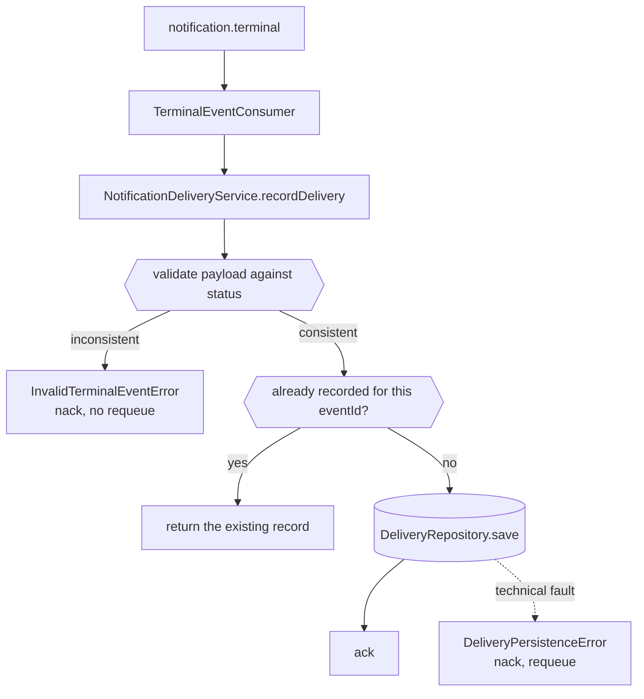

# Full Lifecycle Design

**Spec**: `.specs/features/full-lifecycle/spec.md`
**Status**: Draft

---

## Architecture Overview

The smallest of the three designs, because this service is already shaped for it. `TerminalEventDto` already declares `zipStorageKey?` and `failureReason?`; what is missing is that `DeliveryRecord` keeps neither, and that validation stops at the `status` field.

Two changes: widen the record to retain the outcome detail, and move validation from "is the status one of two values" to "does the payload agree with the status it claims".



The distinction the consumer already draws — contract violations are not requeued, technical faults are — is what this slice extends rather than replaces.

---

## Code Reuse Analysis

### Existing Components to Leverage

| Component | Location | How to Use |
| --- | --- | --- |
| Terminal contract | `src/notifications/dtos/terminal-event.dto.ts` | Already correct; no change needed. It is the Catalog that is out of step |
| Typed errors | `src/notifications/domain/errors/` | `InvalidTerminalEventError` already carries a code; the new violations become new codes on it |
| Idempotency | `NotificationDeliveryService.recordDelivery` | The `findByEventId` short-circuit already exists and is reused unchanged |
| Consumer nack policy | `src/notifications/infrastructure/messaging/terminal-event.consumer.ts:52` | Already routes `InvalidTerminalEventError` to `nack(false, false)` and persistence errors to requeue |
| Repository port | `src/notifications/domain/delivery.repository.ts` | Unchanged; only the record it stores grows |

### Integration Points

| System | Integration Method |
| --- | --- |
| Processing Catalog | Publishes the terminal event this service consumes. Its DTO gains `failureReason` in the same slice |
| Notification Service S7 | Reads `zipStorageKey` or `failureReason` off the stored record to render an email |

---

## Components

### `DeliveryRecord` (modified)

- **Purpose**: Retain everything a later notification needs to describe the outcome.
- **Location**: `src/notifications/domain/delivery-record.ts`
- **Interfaces**: adds `zipStorageKey?: string` and `failureReason?: string`
- **Dependencies**: none
- **Reuses**: the existing class shape

### Terminal event validation

- **Purpose**: Refuse an event whose payload contradicts the status it declares.
- **Location**: `src/notifications/application/notification-delivery.service.ts`
- **Interfaces**: private guard invoked before deduplication
- **Dependencies**: `InvalidTerminalEventError`
- **Reuses**: the existing status check, which becomes the first of four rules

Validation runs **before** the deduplication lookup: an invalid event must never create a record it can later be short-circuited against.

---

## Data Models

```typescript
export class DeliveryRecord {
  eventId: string
  processingRequestId: string
  ownerUserId: string
  status: 'COMPLETED' | 'FAILED'
  zipStorageKey?: string     // new, present when COMPLETED
  failureReason?: string     // new, present when FAILED
  recordedAt: Date
}
```

**Relationships**: exactly one of the two optional fields is present, enforced by the validation above rather than by the type system, since the DTO arrives as untyped JSON.

---

## Error Handling Strategy

| Error Scenario | Handling | User Impact |
| --- | --- | --- |
| `status` outside `COMPLETED` and `FAILED` | `InvalidTerminalEventError`; nack without requeue | Unchanged from today |
| `COMPLETED` without `zipStorageKey` | `InvalidTerminalEventError` with `MISSING_ZIP_STORAGE_KEY`; nack without requeue | The defect surfaces at arrival instead of as an empty email |
| `FAILED` without `failureReason` | `InvalidTerminalEventError` with `MISSING_FAILURE_REASON`; nack without requeue | Same |
| Both fields present | `InvalidTerminalEventError` with `AMBIGUOUS_TERMINAL_OUTCOME`; nack without requeue | An ambiguous outcome is never recorded |
| Repository fails | `DeliveryPersistenceError`; nack **with** requeue | A transient fault is retried |
| Redelivery of a recorded `eventId` | The existing record is returned; nothing is written | One delivery per event |

---

## Risks & Concerns

| Concern | Location (file:line) | Impact | Mitigation |
| --- | --- | --- | --- |
| The service becomes stricter about events the Catalog already publishes | `src/notifications/application/notification-delivery.service.ts:24` | If the Catalog's widening lands after this, terminal events would start being rejected | Both changes belong to this slice. The tasks note the ordering, and the Catalog's terminal DTO is verified against these rules before this repository's strictness is enabled |
| An empty-string `failureReason` would pass a naive presence check | `notification-delivery.service.ts` | A `FAILED` record could be stored with nothing to render | The spec's edge case requires an empty value to be treated as absent, and the guard trims before checking |
| `InMemoryDeliveryRepository` loses every record on restart | `src/notifications/infrastructure/persistence/in-memory-delivery.repository.ts` | Deduplication does not survive a restart, so a redelivered event could notify twice once S7 sends email | Owned by S3. Named here so it is a deferral rather than an oversight, and S7 depends on S3 for exactly this reason |

> Lessons note: this repository has no `.specs/LESSONS.md`, so no lessons were available to load.

---

## Tech Decisions (only non-obvious ones)

| Decision | Choice | Rationale |
| --- | --- | --- |
| Where the outcome detail lives | On the delivery record | S7 renders from the record. Re-deriving it from a replayed event would require the broker to still hold a message that has already been acked |
| Validation before deduplication | Yes | Otherwise an invalid event recorded once becomes the cached answer for every redelivery |
| Trust in `failureReason` | Consumed as already safe | The Catalog owns the code-to-text mapping and is the only publisher; re-sanitising here would put the same rule in two places, which is how they drift |
| Rejecting an event carrying both fields | Reject rather than prefer one | A publisher that sends both has a defect; silently picking one would hide it |

> **Project-level decisions:** none; every choice here is local to this service.
