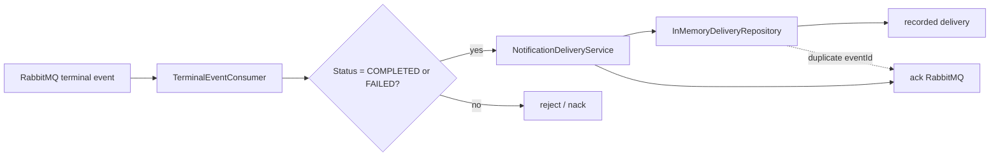

# Notification Service Initial Vertical Slice Design

**Spec**: `.specs/features/initial-vertical-slice/spec.md`
**Status**: Approved from FIAP X first service specifications

---

## Architecture Overview

The Notification Service receives terminal processing events from RabbitMQ and records exactly one local delivery record per terminal `eventId`. It does not send email or change `ProcessingRequest` state in this slice. The design keeps the consumer, delivery logic, and in-memory storage as small, testable units inside the existing NestJS scaffold.



---

## Code Reuse Analysis

### Existing Components to Leverage

| Component | Location | How to Use |
| --- | --- | --- |
| NestJS scaffold | `notification-service/` | Use the existing `src/app.module.ts`, `src/main.ts`, test harness, and `package.json` scripts. |
| Service boundary document | `docs/service-boundary.md` | Source of truth for notification ownership and exclusions. |
| Foundation contracts | `docs/foudation.md` | Defines terminal event field names and RabbitMQ idempotency rules. |
| First service specifications | `.specs/features/first-service-specifications/spec.md` (workspace root) | Maps the notification slice to the end-to-end vertical slice. |

### Integration Points

| System | Integration Method |
| --- | --- |
| RabbitMQ | NestJS microservice listener (`@nestjs/microservices`) reading terminal events. Real broker wiring is deferred; unit tests drive the consumer directly. |
| Amazon SES | Out of scope for this slice. The delivery record marks a controlled placeholder instead of an email send. |
| Processing Catalog | Consumes its terminal events without calling back or modifying state. |

---

## Components

### `TerminalEventConsumer`

- **Purpose**: Receive terminal events from RabbitMQ, validate the terminal status, delegate recording, and acknowledge only after a successful record.
- **Location**: `src/notifications/infrastructure/messaging/terminal-event.consumer.ts`
- **Interfaces**:
  - `handleTerminalEvent(event: TerminalEventDto): Promise<void>` — validates status and calls `NotificationDeliveryService.recordDelivery`. Acknowledges on success; does not acknowledge (nack) on failure or invalid status.
- **Dependencies**: `NotificationDeliveryService`, `TerminalEventDto`.
- **Reuses**: NestJS `@MessagePattern` / `@EventPattern` microservice consumer conventions.

### `NotificationDeliveryService`

- **Purpose**: Apply idempotent delivery recording: create a record for a new terminal `eventId`; return the existing record for duplicates.
- **Location**: `src/notifications/application/notification-delivery.service.ts`
- **Interfaces**:
  - `recordDelivery(event: TerminalEventDto): Promise<DeliveryRecord>` — idempotent record creation.
- **Dependencies**: `DeliveryRepository`.
- **Reuses**: Domain-driven service pattern from NestJS default module structure.

### `InMemoryDeliveryRepository`

- **Purpose**: Provide the repository interface for delivery records using an in-memory `Map`, sufficient to prove deduplication before persistence is added.
- **Location**: `src/notifications/infrastructure/persistence/in-memory-delivery.repository.ts`
- **Interfaces**:
  - `findByEventId(eventId: string): Promise<DeliveryRecord | undefined>` — duplicate check.
  - `save(record: DeliveryRecord): Promise<DeliveryRecord>` — store a new record.
- **Dependencies**: None.
- **Reuses**: Simple repository interface that a future PostgreSQL implementation can replace without changing the service.

### Local DTOs

- **Purpose**: Document the consumed JSON shape as a local TypeScript interface/DTO; no shared contracts package.
- **Location**: `src/notifications/dtos/terminal-event.dto.ts`, `src/notifications/domain/delivery-record.ts`
- **Interfaces**:
  - `TerminalEventDto` — fields: `eventId`, `processingRequestId`, `ownerUserId`, `status`, `zipStorageKey?`, `failureReason?`, `occurredAt`.
  - `DeliveryRecord` — fields: `eventId`, `processingRequestId`, `ownerUserId`, `status`, `recordedAt`.
- **Dependencies**: None.
- **Reuses**: Field names copied from `docs/foudation.md` terminal-event contract.

---

## Data Models

### `TerminalEventDto`

```typescript
export class TerminalEventDto {
  eventId: string;
  processingRequestId: string;
  ownerUserId: string;
  status: 'COMPLETED' | 'FAILED';
  zipStorageKey?: string;
  failureReason?: string;
  occurredAt: string; // ISO-8601
}
```

### `DeliveryRecord`

```typescript
export class DeliveryRecord {
  eventId: string;
  processingRequestId: string;
  ownerUserId: string;
  status: 'COMPLETED' | 'FAILED';
  recordedAt: Date;
}
```

**Relationships**: One `DeliveryRecord` is created from one terminal `TerminalEventDto`. The `eventId` is the unique deduplication key.

---

## Error Handling Strategy

| Error Scenario | Handling | User Impact |
| --- | --- | --- |
| Non-terminal status (`status` not `COMPLETED`/`FAILED`) | Consumer rejects the event and negatively acknowledges it. | No delivery record created; broker may dead-letter. |
| Duplicate `eventId` | Service returns the existing record; consumer acknowledges. | No second delivery record; RabbitMQ redelivery is harmless. |
| Repository save failure | Service throws; consumer does not acknowledge. | Message stays in queue for technical redelivery. |
| Missing required field | Treat as invalid event: reject and do not acknowledge. | No delivery record created. |

---

## Risks & Concerns

| Concern | Location | Impact | Mitigation |
| --- | --- | --- | --- |
| In-memory records are lost on restart | `InMemoryDeliveryRepository` | Duplicate notifications are possible after a crash in a real deployment. | Documented as a slice limitation; persistence is added in a later slice. |
| SES is stubbed, not integrated | `NotificationDeliveryService` | Email is not actually sent yet. | Explicitly out of scope; the delivery record proves the consumer path. |
| RabbitMQ broker is not wired yet | `TerminalEventConsumer` | Only direct unit tests exist in this slice. | Consumer is implemented against NestJS microservice interfaces so broker wiring is a future configuration task. |

---

## Tech Decisions

| Decision | Choice | Rationale |
| --- | --- | --- |
| Storage | In-memory `Map` | Proves idempotency before adding PostgreSQL/RDS. |
| DTO ownership | Local DTOs in the service | Follows the approved foundation: documented JSON contracts, no shared package in the MVP. |
| Idempotency key | `eventId` from terminal event | Matches the foundation's deduplication requirement for consumers. |
| Ack behavior | Ack after successful record; nack on invalid status or save failure | Prevents message loss for transient failures and avoids creating bad records. |
| SES integration | Excluded from this slice | The slice proves terminal-event handling before adding AWS SES. |
