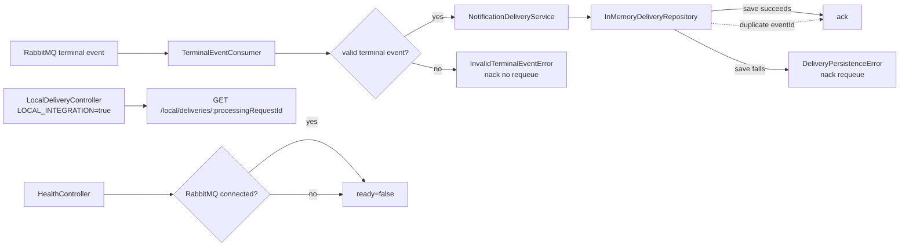

# Notification Service Local Docker Integration Design

**Spec**: `/Volumes/HIKSEMI/repository/fiap-x/fiapx/notification-service/.specs/features/local-docker-integration/spec.md`
**Status**: Design

---

## Architecture Overview

The Notification Service joins the local Docker system by consuming real RabbitMQ terminal events, recording one in-memory delivery per terminal `eventId`, and exposing a read-only local observation route only when `LOCAL_INTEGRATION=true`. It also exposes a `/health` endpoint whose readiness reflects the RabbitMQ connection state. The slice keeps SES out of scope and preserves the existing service boundary: it does not change `ProcessingRequest` state or implement email transmission.



---

## Code Reuse Analysis

### Existing Components to Leverage

| Component | Location | How to Use |
| --- | --- | --- |
| NestJS scaffold | `/Volumes/HIKSEMI/repository/fiap-x/fiapx/notification-service/src/main.ts`, `/Volumes/HIKSEMI/repository/fiap-x/fiapx/notification-service/src/app.module.ts` | Extend with RMQ microservice, health controller, and conditional local modules. |
| Delivery domain | `/Volumes/HIKSEMI/repository/fiap-x/fiapx/notification-service/src/notifications/domain/delivery-record.ts`, `/Volumes/HIKSEMI/repository/fiap-x/fiapx/notification-service/src/notifications/domain/delivery.repository.ts` | Keep the same `DeliveryRecord` and repository port; no persistence changes. |
| In-memory repository | `/Volumes/HIKSEMI/repository/fiap-x/fiapx/notification-service/src/notifications/infrastructure/persistence/in-memory-delivery.repository.ts` | Reuse for local idempotency; add test hook to simulate technical failure. |
| NotificationDeliveryService | `/Volumes/HIKSEMI/repository/fiap-x/fiapx/notification-service/src/notifications/application/notification-delivery.service.ts` | Replace generic `Error` throws with typed domain/technical errors. |
| TerminalEventConsumer | `/Volumes/HIKSEMI/repository/fiap-x/fiapx/notification-service/src/notifications/infrastructure/messaging/terminal-event.consumer.ts` | Keep manual ack/nack; classify errors by type instead of by message text. |
| TerminalEventDto | `/Volumes/HIKSEMI/repository/fiap-x/fiapx/notification-service/src/notifications/dtos/terminal-event.dto.ts` | Add class-validator decorators so missing `processingRequestId` is caught as a domain error. |

### Integration Points

| System | Integration Method |
| --- | --- |
| RabbitMQ | NestJS microservice (`@nestjs/microservices`, `Transport.RMQ`) with `noAck: false` and explicit ack/nack. |
| Processing Catalog | Consumes terminal events published by Catalog; no callback or state mutation. |
| Local smoke test | Reads delivery evidence through the conditional local-only HTTP route. |
| Amazon SES | Out of scope; the delivery record is a local observation only. |

---

## Components

### `InvalidTerminalEventError`

- **Purpose**: Distinguish invalid-domain input (bad status, missing `processingRequestId`, malformed event) from technical failures.
- **Location**: `/Volumes/HIKSEMI/repository/fiap-x/fiapx/notification-service/src/notifications/domain/errors/invalid-terminal-event.error.ts`
- **Interfaces**: Extends `Error`; carries a `code` property such as `INVALID_TERMINAL_STATUS` or `MISSING_PROCESSING_REQUEST_ID`.
- **Dependencies**: None.
- **Reuses**: Plain domain error pattern.

### `DeliveryPersistenceError`

- **Purpose**: Wrap unexpected repository/technical failures so the consumer can nack with requeue.
- **Location**: `/Volumes/HIKSEMI/repository/fiap-x/fiapx/notification-service/src/notifications/domain/errors/delivery-persistence.error.ts`
- **Interfaces**: Extends `Error`; carries `cause?: Error`.
- **Dependencies**: None.
- **Reuses**: Plain domain error pattern.

### `NotificationDeliveryService`

- **Purpose**: Validate terminal input, enforce idempotency by `eventId`, and translate repository failures into typed technical errors.
- **Location**: `/Volumes/HIKSEMI/repository/fiap-x/fiapx/notification-service/src/notifications/application/notification-delivery.service.ts`
- **Interfaces**:
  - `recordDelivery(event: TerminalEventDto): Promise<DeliveryRecord>` — throws `InvalidTerminalEventError` for invalid input; throws `DeliveryPersistenceError` for unexpected repository failures.
- **Dependencies**: `DeliveryRepository`.
- **Reuses**: Existing service logic; adds type-safe error handling.

### `TerminalEventConsumer`

- **Purpose**: Receive terminal events from the real RabbitMQ queue, validate required fields, delegate recording, and acknowledge only after a successful record. Reject invalid-domain events with `nack(..., false, false)`; requeue technical failures with `nack(..., false, true)`.
- **Location**: `/Volumes/HIKSEMI/repository/fiap-x/fiapx/notification-service/src/notifications/infrastructure/messaging/terminal-event.consumer.ts`
- **Interfaces**:
  - `handleTerminalEvent(event: TerminalEventDto, context: RmqContext): Promise<void>` — validates `processingRequestId`, calls `recordDelivery`, and acks/nacks based on error type.
- **Dependencies**: `NotificationDeliveryService`, `InvalidTerminalEventError`, `DeliveryPersistenceError`.
- **Reuses**: Existing NestJS RMQ consumer and manual acknowledgement pattern.

### `InMemoryDeliveryRepository`

- **Purpose**: Provide the existing in-memory repository port for local idempotency.
- **Location**: `/Volumes/HIKSEMI/repository/fiap-x/fiapx/notification-service/src/notifications/infrastructure/persistence/in-memory-delivery.repository.ts`
- **Interfaces**:
  - `findByEventId(eventId: string): Promise<DeliveryRecord | undefined>` — duplicate check.
  - `save(record: DeliveryRecord): Promise<DeliveryRecord>` — stores a new record; returns existing for duplicate `eventId`.
- **Dependencies**: None.
- **Reuses**: Existing implementation.

### `LocalDeliveryController`

- **Purpose**: Expose delivery evidence only in the local integration profile.
- **Location**: `/Volumes/HIKSEMI/repository/fiap-x/fiapx/notification-service/src/notifications/infrastructure/http/local-delivery.controller.ts`
- **Interfaces**:
  - `GET /local/deliveries/:processingRequestId` — returns the `DeliveryRecord` for the given processing request ID, or `404` when none exists.
- **Dependencies**: `NotificationDeliveryService` or `DeliveryRepository`.
- **Reuses**: NestJS `@Controller` and `@Param` conventions.

### `LocalDeliveryModule`

- **Purpose**: Register the local-only controller and route only when `LOCAL_INTEGRATION=true`.
- **Location**: `/Volumes/HIKSEMI/repository/fiap-x/fiapx/notification-service/src/notifications/infrastructure/http/local-delivery.module.ts`
- **Interfaces**: Standard NestJS module with conditional `imports` registration in `AppModule`.
- **Dependencies**: `LocalDeliveryController`, `NotificationDeliveryService`, `InMemoryDeliveryRepository`.
- **Reuses**: NestJS dynamic module/conditional registration pattern.

### `HealthController`

- **Purpose**: Report service liveness and readiness; readiness is false when RabbitMQ is unavailable.
- **Location**: `/Volumes/HIKSEMI/repository/fiap-x/fiapx/notification-service/src/health/health.controller.ts`
- **Interfaces**:
  - `GET /health` — returns `{ status: 'ok', ready: boolean }`.
- **Dependencies**: `RabbitMqHealthIndicator`.
- **Reuses**: NestJS `@Controller` and `@Get` conventions.

### `RabbitMqHealthIndicator`

- **Purpose**: Track whether the RMQ microservice connection is currently up.
- **Location**: `/Volumes/HIKSEMI/repository/fiap-x/fiapx/notification-service/src/health/rabbitmq-health.indicator.ts`
- **Interfaces**:
  - `isReady(): boolean` — returns the last known connection state.
- **Dependencies**: None.
- **Reuses**: Updated from `connect` / `disconnect` events or from a periodic `amqp-connection-manager` check.

### RabbitMQ Microservice Configuration

- **Purpose**: Wire the NestJS application as a hybrid HTTP + RMQ consumer.
- **Location**: `/Volumes/HIKSEMI/repository/fiap-x/fiapx/notification-service/src/main.ts` and `/Volumes/HIKSEMI/repository/fiap-x/fiapx/notification-service/src/messaging/rabbitmq.config.ts`
- **Interfaces**:
  - `createMicroserviceOptions()` — returns RMQ transport options built from `RABBITMQ_URL`, `RABBITMQ_QUEUE`, `RABBITMQ_EXCHANGE`, and `RABBITMQ_ROUTING_KEY`.
- **Dependencies**: `@nestjs/microservices`.
- **Reuses**: NestJS `NestFactory.create` + `connectMicroservice`.

### `Dockerfile`

- **Purpose**: Build a runnable, minimal container image for the Notification Service in local Docker Compose.
- **Location**: `/Volumes/HIKSEMI/repository/fiap-x/fiapx/notification-service/Dockerfile`
- **Interfaces**:
  - Multistage build based on `node:22-alpine`.
  - Installs dependencies, copies source, runs `npm run build`, and starts with `npm run start:prod`.
  - Exposes port `3003`.
  - Includes a `HEALTHCHECK` that curls `/health`.
- **Dependencies**: `package.json`, `package-lock.json`, NestJS source.
- **Reuses**: Standard Node/Nest container pattern.

---

## Data Models

### `TerminalEventDto`

```typescript
export class TerminalEventDto {
  eventId: string;
  processingRequestId: string;
  ownerUserId: string;
  status: 'COMPLETED' | 'FAILED';
  zipStorageKey?: string;
  failureReason?: string;
  occurredAt: string; // ISO-8601
}
```

### `DeliveryRecord`

```typescript
export class DeliveryRecord {
  eventId: string;
  processingRequestId: string;
  ownerUserId: string;
  status: 'COMPLETED' | 'FAILED';
  recordedAt: Date;
}
```

**Relationships**: One `DeliveryRecord` is created from one valid `TerminalEventDto`. The `eventId` is the unique deduplication key. The local observation route lookups by `processingRequestId` because that is the value returned by the API smoke path.

---

## Error Handling Strategy

| Error Scenario | Typed Error | Handling | User Impact |
| --- | --- | --- | --- |
| Non-terminal status | `InvalidTerminalEventError` | Consumer nacks with `requeue=false`. | No delivery record; broker may dead-letter. |
| Missing `processingRequestId` | `InvalidTerminalEventError` | Consumer nacks with `requeue=false`. | No delivery record. |
| Duplicate `eventId` | None (normal path) | Service returns existing record; consumer acknowledges. | No second delivery record; RabbitMQ redelivery is harmless. |
| Repository save failure | `DeliveryPersistenceError` | Consumer nacks with `requeue=true`. | Message stays in queue for technical redelivery. |
| RabbitMQ disconnect | N/A | `/health` ready flag becomes false. | Orchestrator stops routing traffic until reconnected. |

---

## Local Docker & Health Design

### Container Contract

| Variable | Default | Purpose |
| --- | --- | --- |
| `PORT` | `3003` | HTTP port for health and local observation. |
| `RABBITMQ_URL` | `amqp://localhost:5672` | AMQP broker URL. |
| `RABBITMQ_QUEUE` | `notification.terminal` | Queue consumed by this service. |
| `RABBITMQ_EXCHANGE` | `fiapx.terminal` | Exchange bound by the queue. |
| `RABBITMQ_ROUTING_KEY` | `terminal.event` | Routing key for terminal events. |
| `LOCAL_INTEGRATION` | `false` | When `true`, registers the local-only delivery lookup route. |

### Readiness Semantics

- `GET /health` returns HTTP `200` with `{ status: 'ok', ready: true }` when the RMQ microservice connection is established.
- It returns HTTP `503` with `{ status: 'ok', ready: false }` when RabbitMQ is unavailable, satisfying the edge case that unavailability must make readiness false.
- Liveness always returns `200` while the process is running.

### Local-Only Route Guard

- `LocalDeliveryModule` is registered inside `AppModule` only when `process.env.LOCAL_INTEGRATION === 'true'`.
- In production-like profiles the route is absent, so delivery evidence cannot be observed externally.

---

## Risks & Concerns

| Concern | Location | Impact | Mitigation |
| --- | --- | --- | --- |
| In-memory records are lost on restart | `InMemoryDeliveryRepository` | Duplicate notifications are possible after a crash in a real deployment. | Documented as a slice limitation; persistence is deferred. |
| SES is still out of scope | `NotificationDeliveryService` | Email is not actually sent yet. | Explicitly out of scope; the delivery record proves the local consumer path. |
| Typed error taxonomy may leak into other slices | `src/notifications/domain/errors` | Future slices must keep domain/technical separation. | Errors are isolated under the notification domain and reused consistently. |
| AppleDouble metadata files may break lint/Jest on macOS | `.gitignore`, `jest` config, `eslint.config.mjs` | CI or local test runs fail on `._*` binaries. | Keep `._*` in `.gitignore` and add explicit ignore patterns to Jest and ESLint. |

---

## Tech Decisions

| Decision | Choice | Rationale |
| --- | --- | --- |
| Storage | In-memory `Map` | Matches the local-only slice; persistence is out of scope. |
| Error taxonomy | `InvalidTerminalEventError` and `DeliveryPersistenceError` | Separates invalid input from transient infrastructure failures so the consumer can choose the right nack behavior. |
| Local observation | Conditional controller behind `LOCAL_INTEGRATION=true` | Gives the smoke test deterministic evidence without exposing it in production profiles. |
| Health indicator | Manual RMQ connection state | Avoids adding `@nestjs/terminus` for a single boolean readiness flag. |
| Dockerfile | `node:22-alpine` multistage | Consistent with the sibling NestJS services and keeps the image small. |
| Port | `3003` | Matches the API local integration assumption (API 3000, Catalog 3001, Worker 3002, Notification 3003). |
