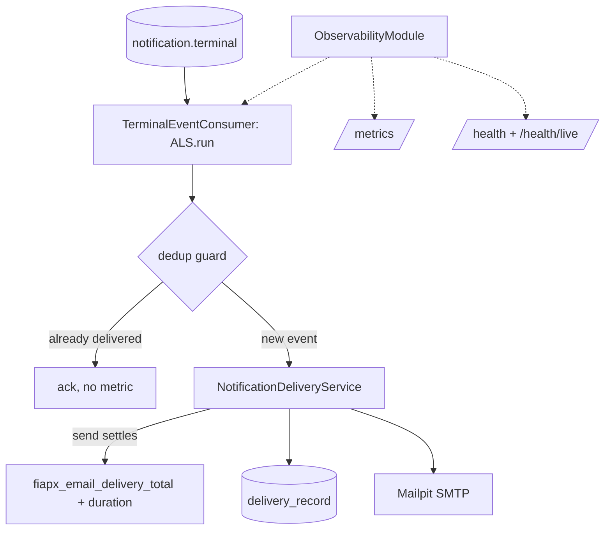

# Observability Design — Notification Service

**Spec**: `.specs/features/observability/spec.md` (OBS-46..60)
**Status**: Draft

---

## Architecture Overview

Same `ObservabilityModule` spine (nestjs-pino + ALS `CorrelationContext` + dedicated prom-client registry). The consumer opens the ALS scope from the terminal event's `correlationId`; the delivery service increments `fiapx_email_delivery_total` exactly once per real send attempt — after dedup, so a redelivery that hits the dedup guard never double-counts. Health becomes honest: `/health` flips 503 on dependency loss (today it returns HTTP 200 with `ready:false` in the body), and `/health/live` is added.



---

## Code Reuse Analysis

### Existing Components to Leverage

| Component | Location | How to Use |
| --- | --- | --- |
| Dedup guard | `src/notifications/infrastructure/persistence/typeorm-delivery.repository.ts` + consumer flow | Metric hook placed **after** the guard — dedup-hit acks without incrementing |
| Settle/retry logic | `src/notifications/infrastructure/messaging/settle-failed-message.ts` (`InvalidTerminalEventError` DLQs at once) | Unchanged (AD-012) |
| Delivery recording | `NotificationDeliveryService` | Owns the send + the metric increment in the same settle path |
| Health indicators | `src/health/rabbitmq-health.indicator.ts`, database indicator | Reused; the controller now maps them to HTTP status |
| SMTP config | `src/notifications/infrastructure/smtp-config.ts` (or equivalent) | Unchanged |
| S7 log-capture e2e | "no log line contains the address" | Extended to keep passing under pino (redaction makes it structural) |

### Integration Points

| System | Integration Method |
| --- | --- |
| processing-catalog | Terminal event `data` gains optional `correlationId` (DTO change only) |
| Mailpit | Unchanged SMTP |
| Prometheus (platform) | Scrapes `GET /metrics` on port 3003 |

---

## Components

### Consumer correlation wrapper

- **Purpose**: OBS-46/47 — set the log context from the terminal event.
- **Location**: `src/messaging/with-correlation.ts`; applied in `src/notifications/terminal-event.consumer.ts` (or its current location)
- **Interfaces**: `const id = parseCorrelationId(event?.correlationId) ?? randomUUID(); await runWithCorrelation(id, () => this.handle(event, ctx))`; strict parse (L-010), absent/invalid never dead-letters for this reason alone (only genuine malformed events keep going to the DLQ as today).
- **Dependencies**: CorrelationContext
- **Reuses**: identical helper shape as the other services

### TerminalEventDto + delivery metrics

- **Purpose**: OBS-48..53.
- **Location**: `src/notifications/dtos/terminal-event.dto.ts`, `NotificationDeliveryService`, `src/observability/metrics.ts` + `metrics.controller.ts`
- **Interfaces**:
  - DTO gains `correlationId?: string`
  - `recordEmailDelivery(outcome: 'sent'|'failed', durationSeconds: number)` -> `fiapx_email_delivery_total` + `fiapx_email_send_duration_seconds`, invoked once when a send attempt settles (success or throw), never on dedup-hit
  - `resetMetrics()` for tests
- **Dependencies**: `prom-client`
- **Reuses**: existing exactly-one-email-per-event flow — the metric inherits its strongest property by placement, not by a new dedup

### Health split

- **Purpose**: OBS-54/55.
- **Location**: `src/health/health.controller.ts`
- **Interfaces**: `GET /health` -> 503 `{status:'error', ...}` when `RabbitMqHealthIndicator.isReady()` or `DatabaseHealthIndicator.isHealthy()` is false (replacing the always-200), 200 otherwise; `GET /health/live` -> 200 while serving.
- **Reuses**: both indicators unchanged
- **Note**: at boot the DB factory still crashes the process on connection failure (existing behavior) — readiness 503 is for runtime dependency loss; compose `depends_on` ordering already guarantees DB-up-before-boot.

### Pino root config

- **Purpose**: OBS-48/49 — JSON logs, correlation id, email never logged.
- **Location**: `src/observability/logger.config.ts`
- **Interfaces**: ALS mixin; `redact` paths `*.ownerEmail`, `*.email`, `req.headers.authorization`, plus SMTP envelope keys (`*.envelope` defensive); the S7 assertion e2e (no address in any line) keeps running and now also pins the redaction config.
- **Reuses**: nestjs-pino

---

## Data Models

```typescript
// terminal event DTO addition
correlationId?: string;

// metric families
fiapx_email_delivery_total{outcome="sent|failed"}
fiapx_email_send_duration_seconds // histogram, label-free
```

---

## Error Handling Strategy

| Error Scenario | Handling | User Impact |
| --- | --- | --- |
| SMTP send throws | `outcome="failed"` counted once, duration observed, failure recorded in `delivery_record` as today (spec S7), message settles per existing rules | Request state unchanged (S7 guarantee) |
| Dedup-hit (redelivery) | ack, no metric increment | Dashboard never double-counts |
| `correlationId` absent/invalid | Generated id for logs; event handled normally | None |
| DB down at runtime | `/health` 503, `/health/live` 200, `/metrics` 200 | Platform sees not-ready; scrape survives |

---

## Risks & Concerns

| Concern | Location (file:line) | Impact | Mitigation |
| --- | --- | --- | --- |
| Metric placement on the wrong side of the dedup guard | consumer/service boundary | Double-counted emails on redelivery | The exactly-once AC (OBS-52) is tested with a real redelivery in the broker e2e; the guard-first ordering is asserted by that test |
| Health flip changes compose behavior | `compose.yaml` notification healthcheck probes `/health` | If the DB is slow at boot, the container could flap | Boot crash-on-DB-failure is the existing behavior, so `/health` only goes 503 on runtime loss; `depends_on: postgres healthy` already orders startup |
| `data: null` / malformed events (V58, still open) | consumer catch path | Unrelated to S8 but the wrapper must not regress it | The wrapper only touches the context; malformed-event handling keeps its current settle path — noted as a regression-watch in tasks |
| pino redaction of the recipient | log call sites | AD-015 breach via a future log line | Redact `*.ownerEmail`/`*.email` + keep the S7 no-address e2e |

---

## Tech Decisions (only non-obvious ones)

| Decision | Choice | Rationale |
| --- | --- | --- |
| Metric lives in the delivery service, not the consumer | the service knows send vs dedup vs record | Consumer stays a transport shell |
| Health maps indicator state to HTTP status instead of a body flag | scraper-friendly (seed criterion 3) | HTTP 200-with-ready-false is invisible to `--wait` and k8s-style probes |
| Exact package versions | pinned at task time via npm | avoids fabricated versions |
