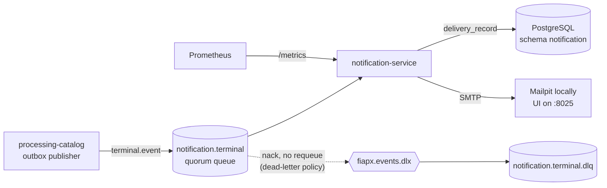
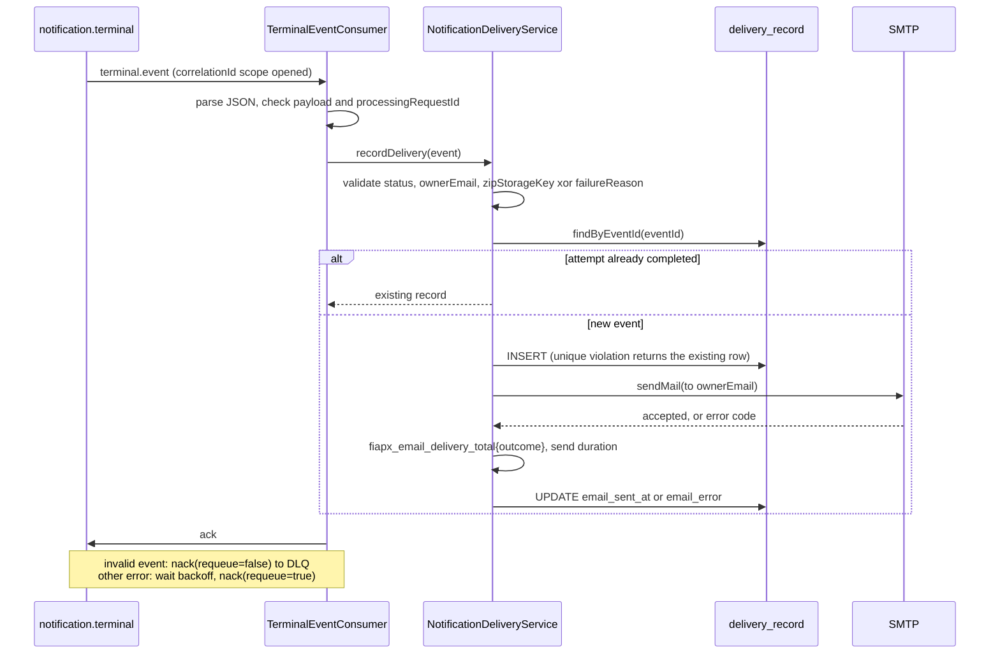

# Notification Service

Consumes the terminal events of FIAP X processing requests and sends the request owner one email per event over SMTP: a completion notice, or a failure notice carrying the reason (RF-5, "notify the user on error"). It records each delivery in its own PostgreSQL schema and never changes a processing request's state.

It is one of five repositories of the FIAP X hackathon system (FIAP POSTECH SOAT, phase 5). The system overview, the local topology and the cross-repository decision log (AD-001..AD-018) live in [`fiap-x-platform`](https://github.com/tech-challenge-workshop/fiap-x-platform). Ownership and exclusions are in [the service boundary](docs/service-boundary.md).

## Place in the system

`processing-catalog` owns the request lifecycle. When a request reaches `COMPLETED` or `FAILED` it publishes a terminal event, through its outbox, to the `notification.terminal` queue. The event carries the owner's address as `ownerEmail`, read once by `fiap-x-api` from the token's OIDC `email` claim and carried structurally from there (AD-015). This service never queries an identity provider.



The queue, its `.dlq` and the `dead-letter` policy (`delivery-limit: 5`) are declared by the platform's [broker definitions](https://github.com/tech-challenge-workshop/fiap-x-platform/blob/main/rabbitmq/definitions.json) before any service connects (AD-012). On startup this service's RMQ transport also asserts the topic exchange `fiapx.terminal` and binds the queue to it with `terminal.event`; the Catalog itself publishes straight to the queue.

## Delivery semantics

### The terminal event

Messages are Nest `{ pattern: "terminal.event", data }` envelopes. `data` is read as [`TerminalEventDto`](src/notifications/dtos/terminal-event.dto.ts):

| Field | Notes |
| --- | --- |
| `eventId` | Deduplication key; primary key of `delivery_record` |
| `processingRequestId` | Required, non-blank |
| `ownerUserId` | Stored on the record |
| `ownerEmail` | Required, trimmed. Used only as the recipient; never stored or logged |
| `status` | `COMPLETED` or `FAILED` |
| `zipStorageKey` | Required for `COMPLETED`; forbidden together with `failureReason` |
| `failureReason` | Required for `FAILED`; a user-safe sentence written by the Catalog |
| `occurredAt` | ISO timestamp from the publisher |
| `correlationId` | Optional; opens the log correlation scope (AD-016) |

### What is sent

Plain-text emails from [`email-templates.ts`](src/notifications/application/email-templates.ts), in Portuguese without accents like the rest of the user-facing text:

| Status | Subject | Body |
| --- | --- | --- |
| `COMPLETED` | `Seu video foi processado (<processingRequestId>)` | `O video que voce enviou (pedido <id>) foi processado com sucesso.`<br/>`Acesse a API para baixar o arquivo com os frames extraidos.` |
| `FAILED` | `Nao foi possivel processar seu video (<processingRequestId>)` | `O video que voce enviou (pedido <id>) nao pode ser processado.`<br/>`<failureReason>` |

The email contains no download link and no storage key; the user asks `fiap-x-api` for a short-lived URL.

### Outcomes and acknowledgement

| Situation | What happens | Message |
| --- | --- | --- |
| Valid event, first time | Row inserted, one send attempted, outcome written (`email_sent_at` or `email_error`) | ack |
| SMTP send fails | `email_error` set to the error's `code` (for example `ECONNREFUSED`, `EENVELOPE`), or `Unknown email send failure` when it has none, capped at 200 chars. The error `message` is never stored: nodemailer puts the host or the recipient in it | ack (one attempt per event, no retry) |
| Redelivery of an event whose attempt completed | Nothing sent, nothing counted | ack |
| Redelivery of an event recorded without an outcome | The send is attempted | ack |
| Invalid event (see below) | Nothing recorded, nothing sent | nack without requeue, dead-lettered to `notification.terminal.dlq` |
| Database unavailable, or any other unexpected error | Wrapped in `DeliveryPersistenceError` | nack with requeue after `RABBITMQ_RETRY_BACKOFF_MS` (AD-012: RabbitMQ 4 does not count explicit requeues against the delivery limit, so the pause is what bounds the loop) |

A failed email never changes the terminal result of the processing request; it is recorded and counted as `outcome="failed"`.

Invalid events are rejected with an [`InvalidTerminalEventError`](src/notifications/domain/errors/invalid-terminal-event.error.ts) code: `MALFORMED_JSON`, `INVALID_PAYLOAD`, `MISSING_PROCESSING_REQUEST_ID`, `INVALID_TERMINAL_STATUS`, `MISSING_OWNER_EMAIL`, `AMBIGUOUS_TERMINAL_OUTCOME` (both `zipStorageKey` and `failureReason`), `MISSING_ZIP_STORAGE_KEY` and `MISSING_FAILURE_REASON`. Blank strings count as absent.

### Exactly once, and its limits

Deduplication is a schema guarantee: `event_id` is the primary key, and a unique violation on insert (another consumer won the race) returns the existing row instead of failing. A redelivery is skipped once `email_sent_at` or `email_error` is set. Two windows remain, accepted for the single-replica deployment:

- Two replicas handling the same redelivered event while the first is still sending can both send (documented in [`notification-delivery.service.ts`](src/notifications/application/notification-delivery.service.ts)).
- If the send succeeds but writing the outcome fails, the message is requeued as a persistence error and the redelivery sends again.



## Persistence

TypeORM against PostgreSQL, in the `notification` schema under the `notification` role, which cannot read the Catalog's schema (AD-009). Migrations run at startup, before the consumer accepts events; `synchronize` is off. The schema and role come from the platform's [`db/init/01-schemas.sql`](https://github.com/tech-challenge-workshop/fiap-x-platform/blob/main/db/init/01-schemas.sql).

`delivery_record` ([migrations](src/notifications/infrastructure/persistence/migrations)):

| Column | Type | Migration |
| --- | --- | --- |
| `event_id` | `text` primary key | `CreateDeliveryRecord1789954000000` |
| `processing_request_id` | `text not null`, indexed (`idx_delivery_record_request`) | same |
| `owner_user_id` | `text not null` | same |
| `status` | `text not null` (`COMPLETED` / `FAILED`) | same |
| `zip_storage_key` | `text null` | same |
| `failure_reason` | `text null` | same |
| `recorded_at` | `timestamptz not null` | same |
| `email_sent_at` | `timestamptz null` | `AddEmailOutcome1789959000000` |
| `email_error` | `text null`, error code only | same |

There is no column for the recipient address. With `DATABASE_HOST` unset the service runs on an in-memory repository instead, which is what unit tests and a bare `npm start` use.

## Inside the service

NestJS modules around a small domain core, with ports for the two side effects (`DeliveryRepository`, `EmailSender`), each with a real and an in-memory adapter chosen at boot.

```text
src/
├── main.ts, configure-app.ts   bootstrap: pino logger, RMQ microservice, HTTP on PORT
├── app.module.ts               wires the modules; adds LocalDeliveryModule when LOCAL_INTEGRATION=true
├── health/                     /health readiness (broker + database) and /health/live
├── messaging/                  RMQ transport options and the per-message correlation scope
├── observability/              pino config with redaction, correlation context, Prometheus registry, /metrics
└── notifications/
    ├── application/            NotificationDeliveryService (validate, dedup, send, record) and email templates
    ├── domain/                 DeliveryRecord, repository and sender ports, error types
    ├── dtos/                   the terminal event contract as this service reads it
    └── infrastructure/
        ├── email/              nodemailer SMTP sender, in-memory sender, SMTP config
        ├── http/               local-only GET /local/deliveries/:processingRequestId
        ├── messaging/          terminal-event consumer and the ack / DLQ / requeue decision
        └── persistence/        TypeORM data source, entity, repository, migrations, in-memory repository
```

Key choices:

- **Local DTOs, no shared contracts package** (AD-003): the terminal event shape is this repository's own copy.
- **Classify, then settle** (AD-012): invalid messages go to the DLQ at once, everything else is requeued after a pause ([`settle-failed-message.ts`](src/notifications/infrastructure/messaging/settle-failed-message.ts)).
- **No PII outside the send call** (AD-015, AD-017): the recipient address is not stored, not used as a metric label and not written to `email_error`. The logger removes `email`, `ownerEmail`, `to`, `envelope`, `accepted`, `rejected` and `zipStorageKey` at the root and up to two levels deep, plus the `authorization` and `cookie` headers ([`logger.config.ts`](src/observability/logger.config.ts)).
- **Deduplication in PostgreSQL, no cache tier** (AD-008).
- **Correlation** (AD-016): every log line of a message's handling carries its `correlationId`, or a fresh UUID when it is missing or invalid (printable ASCII, up to 128 chars).

## Tech stack

| Area | Choice |
| --- | --- |
| Runtime | Node.js 22 (`node:22-alpine`), TypeScript ^5.7 |
| Framework | NestJS ^11, `@nestjs/microservices` ^11.2 (RMQ transport) |
| Messaging | `amqplib` ^2.0, `amqp-connection-manager` ^5.0 (RabbitMQ 4 in CI) |
| Persistence | TypeORM ^0.3.31, `pg` ^8.23 (PostgreSQL 17 in CI) |
| Email | `nodemailer` ^10.0 |
| Logs / metrics | `nestjs-pino` ^5.2, `prom-client` ^15.1 |
| Tests / lint | Jest ^30, ts-jest, supertest; ESLint ^9 with Prettier |

**SMTP.** With `SMTP_HOST` set, [`SmtpEmailSender`](src/notifications/infrastructure/email/smtp-email-sender.ts) sends plain text without TLS (`secure: false`) and without authentication, with 5 s connection, greeting and socket timeouts. With `SMTP_HOST` unset an in-memory sender is used and the boot logs a warning: every send then "succeeds" and is recorded as sent although no email left the process.

**Observability** (AD-017), all unauthenticated and kept out of the access log:

| Endpoint | Behaviour |
| --- | --- |
| `GET /metrics` | Prometheus text (`text/plain; version=0.0.4`) from the service's own registry |
| `GET /health` | Readiness: 200 `{"status":"ok","rabbitmq":"up","database":"up"}`; 503 with `"status":"error"` naming which of `rabbitmq` / `database` is down. The broker check uses its own connection to `RABBITMQ_URL`; the database check runs `SELECT 1` and reports up when no database is configured |
| `GET /health/live` | Liveness: 200 while the process serves; never consults a dependency |

Metrics: `fiapx_email_delivery_total{outcome="sent"|"failed"}` (counter; both outcomes exported at 0 from boot, incremented once per settled attempt, never for a deduplicated redelivery) and `fiapx_email_send_duration_seconds` (histogram, no labels). No metric carries an event, request or user id, or an address.

`GET /` still answers the Nest scaffold's `Hello World!`.

## Configuration

Every variable the code reads:

| Variable | Default | Purpose |
| --- | --- | --- |
| `PORT` | `3003` | HTTP port |
| `RABBITMQ_URL` | `amqp://localhost:5672` | Broker for the consumer and the readiness check |
| `RABBITMQ_QUEUE` | `notification.terminal` | Queue consumed |
| `RABBITMQ_EXCHANGE` | `fiapx.terminal` | Topic exchange asserted and bound to the queue |
| `RABBITMQ_ROUTING_KEY` | `terminal.event` | Binding key for that exchange |
| `RABBITMQ_RETRY_BACKOFF_MS` | `1000` | Pause before requeueing a transient failure; `0` is allowed, blank, negative or non-numeric values mean the default |
| `DATABASE_HOST` | unset | Unset: in-memory repository. Set: PostgreSQL with migrations at boot |
| `DATABASE_PORT` | `5432` | |
| `DATABASE_NAME` | `fiapx` | |
| `DATABASE_SCHEMA` | `notification` | |
| `DATABASE_USER` / `DATABASE_PASSWORD` | `notification` / `notification` | Local fixture credentials |
| `SMTP_HOST` | unset | Unset: in-memory sender (warning at boot). Set: nodemailer SMTP |
| `SMTP_PORT` | `1025` | Mailpit's SMTP port |
| `SMTP_FROM` | `fiapx@local` | Sender address |
| `LOG_LEVEL` | `info` | pino level |
| `LOCAL_INTEGRATION` | unset | `true` exposes `GET /local/deliveries/:processingRequestId`, returning the stored record (404 when absent) for the platform smoke. Local only (AD-003) |

Test only: `RABBITMQ_TEST_URL` enables the broker suites, and `CI` turns their missing infrastructure into a failure instead of a skip.

## Running

### With the whole system

The platform's [`compose.yaml`](https://github.com/tech-challenge-workshop/fiap-x-platform/blob/main/compose.yaml) builds this repository from `../notification-service`, so check all five repositories out side by side, then from `fiap-x-platform`:

```sh
docker compose up --build -d --wait
node scripts/smoke-local-integration.mjs
```

The service listens on `localhost:3003` with `LOCAL_INTEGRATION=true`, PostgreSQL, and SMTP to Mailpit. Sent emails are visible in the Mailpit UI at <http://localhost:8025>. Among its steps, the smoke checks that a rejected video yields exactly one delivery and exactly one email. On the kind cluster (AD-018) the service runs the published `:main` image from [`k8s/notification.yaml`](https://github.com/tech-challenge-workshop/fiap-x-platform/blob/main/k8s/notification.yaml), with `/health` as the readiness probe and `/health/live` as the liveness probe.

### On its own

```sh
npm ci
npm run start:dev      # watch mode; also start, start:debug, and build + start:prod
```

Without `DATABASE_HOST` and `SMTP_HOST` it runs on the in-memory adapters. The consumer still needs RabbitMQ at `RABBITMQ_URL`; while it is unreachable `/health` answers 503.

### Tests and checks

```sh
npm run lint           # ESLint, zero warnings allowed
npm run typecheck      # tsc --noEmit
npm test               # unit tests (src/**/*.spec.ts), no infrastructure needed
npm run test:cov       # same, with coverage
npm run test:e2e       # test/*.e2e-spec.ts, one worker
npm run build          # nest build to dist/
```

The e2e suites need real infrastructure:

- `local-integration` connects to RabbitMQ on `localhost:5672` unconditionally.
- `broker` needs `RABBITMQ_TEST_URL` and the platform's definitions loaded (it asserts dead-lettering into `notification.terminal.dlq`).
- `durable-persistence` needs PostgreSQL through the `DATABASE_*` variables; `observability` needs both `RABBITMQ_TEST_URL` and `DATABASE_HOST`.

Locally, those gated suites skip when their variables are unset; with `CI` set, `broker` and `observability` fail instead.

### Docker

```sh
docker build -t notification-service .
docker run --rm -p 3003:3003 -e RABBITMQ_URL=amqp://host.docker.internal:5672 notification-service
```

Two stages on `node:22-alpine`: build, then a runtime with production dependencies and `dist/` only. `PORT=3003`, and a `HEALTHCHECK` polls `/health` every 30 s.

### CI

[`.github/workflows/ci.yml`](.github/workflows/ci.yml) runs on pull requests to `main` and on pushes to `main`:

- **`quality`**: RabbitMQ 4 and PostgreSQL 17 service containers. It checks out `fiap-x-platform` to create the schema and role from `db/init/01-schemas.sql` and to import `rabbitmq/definitions.json` through the management API, so CI runs against the stack's own topology. Then lint, typecheck, unit tests with coverage, e2e with `RABBITMQ_TEST_URL` set, a step that fails if any e2e test was skipped, and build. The coverage report is uploaded as an artifact.
- **`image`** (after `quality`): builds `linux/amd64` and `linux/arm64` with Buildx and QEMU. Only on a push to `main` does it log in with the workflow's `GITHUB_TOKEN` and push `ghcr.io/tech-challenge-workshop/notification-service:<sha>` and `:main`, the tag the kind cluster pulls (AD-018). Pull requests build without pushing.

## Links

- System: [`fiap-x-platform`](https://github.com/tech-challenge-workshop/fiap-x-platform), its [decision log](https://github.com/tech-challenge-workshop/fiap-x-platform/blob/main/.specs/STATE.md) and [foundation document](https://github.com/tech-challenge-workshop/fiap-x-platform/blob/main/docs/foudation.md)
- Siblings: [`fiap-x-api`](https://github.com/tech-challenge-workshop/fiap-x-api), [`processing-catalog`](https://github.com/tech-challenge-workshop/processing-catalog) (publishes the terminal event), [`processing-worker`](https://github.com/tech-challenge-workshop/processing-worker)
- This repository: [service boundary](docs/service-boundary.md), [roadmap](docs/ROADMAP.md), [lessons](.specs/LESSONS.md)
- Feature specs: [initial vertical slice](.specs/features/initial-vertical-slice/spec.md), [local Docker integration](.specs/features/local-docker-integration/spec.md), [full lifecycle](.specs/features/full-lifecycle/spec.md), [durable persistence](.specs/features/durable-persistence/spec.md), [CI pipeline](.specs/features/ci-pipeline/spec.md), [catalog messaging hardening](.specs/features/catalog-messaging-hardening/spec.md), [service robustness](.specs/features/service-robustness/spec.md), [email notification](.specs/features/email-notification/spec.md), [observability](.specs/features/observability/spec.md)
